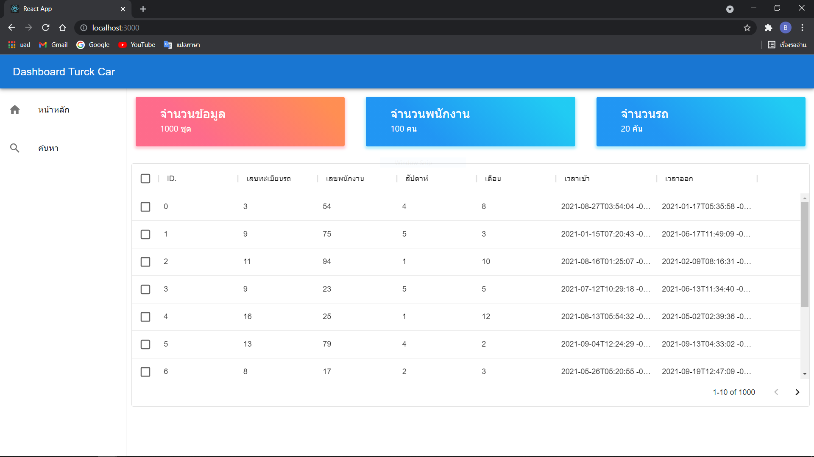
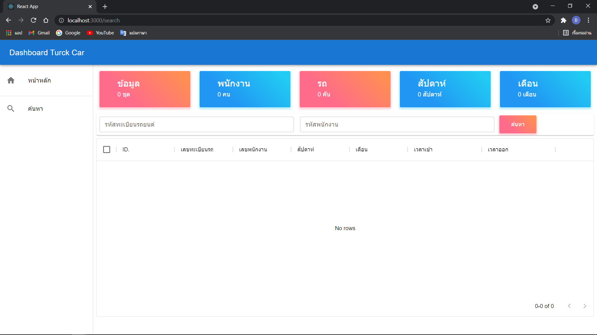

# Project Truck Car DashBoard
```
1. express.js && node.js / backend
2. react.js / frontend
3. material ui / frontend
```

# ขั้นตอนการติดตั้ง
```
1. git clone repos
2. cd backend && sudo npm install 
3. cd frontend && sudo npm install
4. cd backend -> npm run serve
5. cd frontend -> npm start
```
# ตัวอย่างโปรเจค



